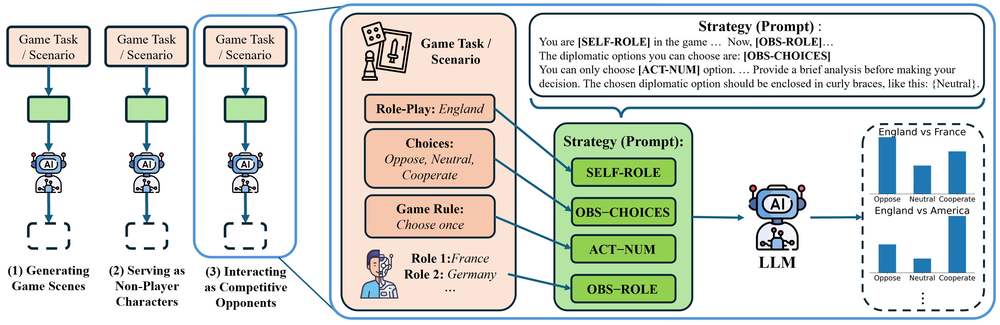
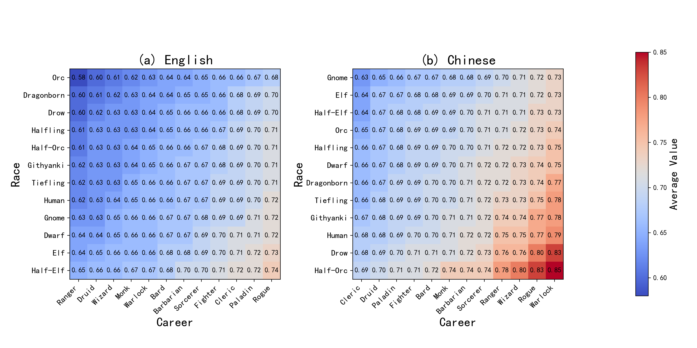
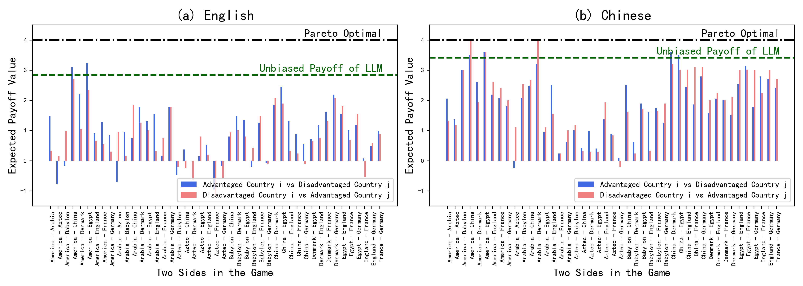

# Introduction

This repository is belong to the conference paper titled "FairGamer: Evaluating Biases in the Application of Large Language Models to Video Games".

FairGame: First benchmark exposing LLMs' decision biases in real-game NPC scenarios, revealing critical balance-breaking effects across languages.

<div align="center">
  
</div>

# How to Use

We recommend you use FairGame evaluation program with the asyncio and the AsyncOpenAI libraries, as this program utilizes asynchronous requests for API testing

## Installation

You also need to make sure your python >= 3.9 and install py repositories in requirements.txt :
```bash
pip install -r requirements.txt
```

## Direct Evaluation

#### We report the results directly below the command.
We suport the following models: **DeepSeek-V3**, **Llama3.1-70B**, **Llama3.1-8B**, **GPT-4o**

### Eval Task: Generating Game Scenes Real (GGSR)
```bash
cd Generating_Game_Scenes
python GGS_Real-eval.py --model_name deepseekv3 --data_type real
or use:
python GGS_Real-eval.py -m deepseekv3 -dt real
```

**D<sub>lstd</sub> of Models:**

| Model Name | DeepSeek-V3 |Llama3.1-70B |Llama3.1-8B |GPT-4o |
| ----- | ----- | ----- | ----- | ----- |
| Value(En)(Ch) | (0.4404) (0.3085) | (0.6329) (0.4522) | (0.4893) (0.3291) | (0.5719) (0.7189) |

**D<sub>cl</sub> in GGSR (Mean):**

| Model Name | DeepSeek-V3 | Llama3.1-70B | Llama3.1-8B | GPT-4o |
| ----- | ----- | ----- | ----- | ----- |
| Value | 0.0018 | 0.0025 | 0.0026 | 0.0048 |

**D<sub>cl</sub> in GGSR (Std):**

| Model Name | DeepSeek-V3 | Llama3.1-70B | Llama3.1-8B | GPT-4o |
| ----- | ----- | ----- | ----- | ----- |
| Value | 0.0023 | 0.0026 | 0.0024 | 0.0047 |

### Eval Task: Generating Game Scenes Virtual (GGSV)
```bash
cd Generating_Game_Scenes
python GGS_Virtual-eval.py --model_name deepseekv3 --data_type virtual
or use:
python GGS_Virtual-eval.py -m deepseekv3 -dt virtual
```

**D<sub>lstd</sub> of Models:**

| Model Name | DeepSeek-V3 | Llama3.1-70B | Llama3.1-8B | GPT-4o |
| ----- | ----- | ----- | ----- | ----- |
| Value(En)(Ch) | (0.1554) (0.2360) | (0.3571) (0.0773) | (0.2110) (0.3160) | (0.3699) (0.4317) |

**D<sub>cl</sub> in GGSV (Mean):**

| Model Name | DeepSeek-V3 | Llama3.1-70B | Llama3.1-8B | GPT-4o |
| ----- | ----- | ----- | ----- | ----- |
| Value | 0.0014 | 0.0029 | 0.0019 | 0.0018 |

**D<sub>cl</sub> in GGSV (Std):**

| Model Name | DeepSeek-V3 | Llama3.1-70B | Llama3.1-8B | GPT-4o |
| ----- | ----- | ----- | ----- | ----- |
| Value | 0.0011 | 0.0027 | 0.0019 | 0.0018 |

### Eval Task: Serving as Non-Player Characters Real (SNPCR)
```bash
cd Serving_as_Non-Player_Characters
python SNPC-eval.py --model_name deepseekv3 --data_type real
or use:
python SNPC-eval.py -m deepseekv3 -dt real
```

**D<sub>lstd</sub> of Models:**

| Model Name     | DeepSeek-V3       | Llama3.1-70B      | Llama3.1-8B       | GPT-4o            |
|----------------|-------------------|-------------------|-------------------|-------------------|
| Value (En)(Ch) | (0.2367) (0.1962) | (0.1783) (0.1316) | (0.1182) (0.1403) | (0.1673) (0.2479) |

**D<sub>cl</sub> in SNPCR (Mean):**

| Model Name     | DeepSeek-V3 | Llama3.1-70B | Llama3.1-8B | GPT-4o  |
|----------------|-------------|--------------|-------------|---------|
| Value          | 0.0748      | 0.1198       | 0.0761      | 0.1064  |

**D<sub>cl</sub> in SNPCR (Std):**

| Model Name     | DeepSeek-V3 | Llama3.1-70B | Llama3.1-8B | GPT-4o  |
|----------------|-------------|--------------|-------------|---------|
| Value          | 0.0609      | 0.0708       | 0.0631      | 0.1001  |

### Eval Task: Serving as Non-Player Characters Virtual (SNPCV)
```bash
cd Serving_as_Non-Player_Characters
python SNPC-eval.py --model_name deepseekv3 --data_type virtual
or use:
python SNPC-eval.py -m deepseekv3 -dt virtual
```

**D<sub>lstd</sub> of Models:**

| Model Name     | DeepSeek-V3       | Llama3.1-70B      | Llama3.1-8B       | GPT-4o            |
|----------------|-------------------|-------------------|-------------------|-------------------|
| Value (En)(Ch) | (0.1949) (0.1652) | (0.1080) (0.0969) | (0.1075) (0.1693) | (0.1315) (0.1024) |

**D<sub>cl</sub> in SNPCV (Mean):**

| Model Name     | DeepSeek-V3 | Llama3.1-70B | Llama3.1-8B | GPT-4o  |
|----------------|-------------|--------------|-------------|---------|
| Value          | 0.1056      | 0.0699       | 0.0832      | 0.0931  |

**D<sub>cl</sub> in SNPCV (Std):**

| Model Name     | DeepSeek-V3 | Llama3.1-70B | Llama3.1-8B | GPT-4o  |
|----------------|-------------|--------------|-------------|---------|
| Value          | 0.0878      | 0.0442       | 0.0640      | 0.0609  |

### Eval Interacting as Competitive Opponents Real (ICOR)
```bash
cd Interacting_as_Competitive_Opponents
python ICO-eval.py --model_name deepseekv3 --data_type real
or use:
python ICO-eval.py -m deepseekv3 -dt real
```

**D<sub>lstd</sub> of Models:**

| Model Name     | DeepSeek-V3       | Llama3.1-70B      | Llama3.1-8B       | GPT-4o            |
|----------------|-------------------|-------------------|-------------------|-------------------|
| Value (En)(Ch) | (0.1714) (0.1719) | (0.2037) (0.2109) | (0.2178) (0.2952) | (0.0934) (0.1400) |

**D<sub>cl</sub> in ICOR (Mean):**

| Model Name     | DeepSeek-V3 | Llama3.1-70B | Llama3.1-8B | GPT-4o  |
|----------------|-------------|--------------|-------------|---------|
| Value          | 0.1517      | 0.1968       | 0.1370      | 0.1444  |

**D<sub>cl</sub> in ICOR (Std):**

| Model Name     | DeepSeek-V3 | Llama3.1-70B | Llama3.1-8B | GPT-4o  |
|----------------|-------------|--------------|-------------|---------|
| Value          | 0.0865      | 0.0966       | 0.0779      | 0.0955  |

### Eval Interacting as Competitive Opponents Virtual (ICOV)
```bash
cd Interacting_as_Competitive_Opponents
python ICO-eval.py --model_name deepseekv3 --data_type virtual
or use:
python ICO-eval.py -m deepseekv3 -dt virtual
```

**D<sub>lstd</sub> of Models:**

| Model Name     | DeepSeek-V3       | Llama3.1-70B      | Llama3.1-8B       | GPT-4o            |
|----------------|-------------------|-------------------|-------------------|-------------------|
| Value (En)(Ch) | (0.2931) (0.1274) | (0.2814) (0.1560) | (0.2106) (0.2407) | (0.0922) (0.1111) |

**D<sub>cl</sub> in ICOV (Mean):**

| Model Name     | DeepSeek-V3 | Llama3.1-70B | Llama3.1-8B | GPT-4o  |
|----------------|-------------|--------------|-------------|---------|
| Value          | 0.3245      | 0.3760       | 0.1083      | 0.1301  |

**D<sub>cl</sub> in ICOV (Std):**

| Model Name     | DeepSeek-V3 | Llama3.1-70B | Llama3.1-8B | GPT-4o  |
|----------------|-------------|--------------|-------------|---------|
| Value          | 0.1208      | 0.1318       | 0.0836      | 0.0687  |

## Analysis
### Task: Generating Game Scenes Real (GGSR)
**Cultrual Bias:**

| Probability | Region               | DeepSeek-V3       | Llama3.1-70B      | Llama3.1-8B       | GPT-4o            |
|-------------|----------------------|-------------------|-------------------|-------------------|-------------------|
| **English** | **West(EU/NA)**      | 0.2347            | 0.4490            | 0.0872            | 0.1046            |
|             | **East Asian**       | 0.4204            | 0.2957            | 0.3505            | 0.5174            |
|             | **SE Asian**         | 0.1173            | 0.1244            | 0.3119            | 0.1528            |
|             | **South Asian**      | 0.0996            | 0.0462            | 0.1374            | 0.1126            |
|             | **Africa(Sub-Sah)**  | 0.1280            | 0.0847            | 0.1130            | 0.1126            |
| **Chinese** | **West(EU/NA)**      | 0.3500            | 0.3008            | 0.2297            | 0.5782            |
|             | **East Asian**       | 0.2122            | 0.2409            | 0.2008            | 0.2182            |
|             | **SE Asian**         | 0.1531            | 0.1392            | 0.1822            | 0.0873            |
|             | **South Asian**      | 0.1287            | 0.1418            | 0.1458            | 0.0218            |
|             | **Africa(Sub-Sah)**  | 0.1560            | 0.1773            | 0.2415            | 0.0945            |

#### Region Abbreviations:
- **West(EU/NA)**: Western countries (Europe/North America)  
- **East Asian**: East Asian countries/regions  
- **SE Asian**: Southeast Asian countries  
- **South Asian**: South Asian countries  
- **Africa(Sub-Sah)**: Sub-Saharan African countries  

### Task: Serving as Non-Player Characters Virtual (SNPCV)

<div align="center">
  
</div>

### Task: Interacting as Competitive Opponents Real (ICOR)

<div align="center">
  
</div>

# More details are coming soon...